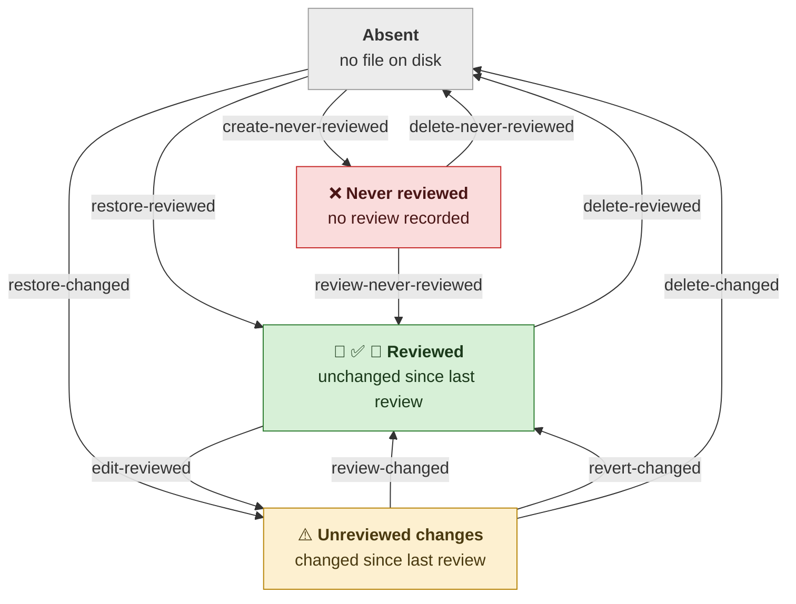

# Review lifecycle

The diagram below illustrates the states a file can be in with respect to review and how the state changes. `Reviewed` is where every file should be.



## How changes in review status are reflected in the report

The report excerpts below reflect the changing status of one file, `greeting.txt`, over three transitions in the state diagram.

The file starts with no review recorded (state = *Never reviewed*):

```
        ❌     greeting.txt
```

A careful review is recorded (transition via **`review-never-reviewed`** to state *Reviewed*):

```
     👀 ✅     greeting.txt   A Person, 2026-09-02  unchanged since bce72d7
```

A line is added, with no new review yet recorded (transition via **`edit-reviewed`** to state *Unreviewed changes*):

```
        ⚠️     greeting.txt   A Person, 2026-09-02  +1 −0 since bce72d7
```

The line is taken back out (transition via **`revert-changed`** to state *Reviewed*):

```
     👀 ✅     greeting.txt   A Person, 2026-09-02  unchanged since bce72d7
```


See [`README.md`](README.md) for the commands, what each icon means, and how a formal review names the artifact that records it.
