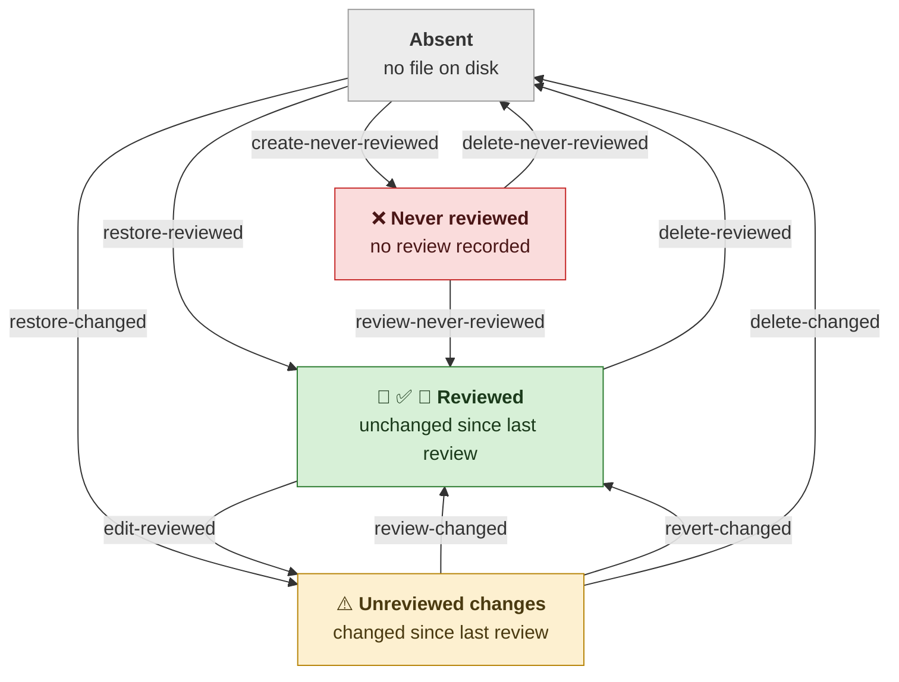

# Review lifecycle

The diagram below illustrates the states a file can be in with respect to review and how the state changes. `Reviewed` is where every file should be.

## Marks

A review can be cursory, careful, or formal. The level of care is recorded as a qualifier on the `Reviewed` state rather than as a state of its own.

The report gives each mark a column of its own: whose file it is, then whether anyone looked, what they concluded, and whether a protocol was followed. A review fills the last three from the left, so its strength reads as how far it gets, and everything that is not a review starts at the verdict, where ✅ ❌ ⚠️ line up beneath one another.

| | | | | | Description |
|---|---|---|---|---|---|
| ⚙️ |  |  |  | **framework** | Came with the framework; not ours to review. |
| 🛠️ |  |  |  | **generated** | Produced by something else; review its generator instead. |
|  ✍️ |  | 🟢 |  | **human** | Written by a person; reviewed by definition. |
|  | 👀 |  |  | **cursory** | File eyeballed. No claim that it is correct. |
|  | 👀 | ✅ |  | **careful** | File read through and judged likely correct by the reader. |
|  | 👀 | ✅ | 🔬 | **formal** | File inspected via a defined protocol, and the review names the artifact recording its conclusion. |
|  |  | ⚠️ |  | **changed** | Reviewed earlier; changed since. |
|  |  | ❌ |  | **unreviewed** | No review recorded. |

`reviews record` stores `cursory`.  Adding the `--careful` option raises the review type. 

A file that is not ours wants no reviewer, so it shows only its origin. Review one anyway and the origin stays — the marks appear alongside it rather than in place of it, because a cursory look should not erase the fact that the file was never ours to review.

See [`README.md`](README.md) for the commands, the review types in full, and how a formal review names the artifact that records it.
